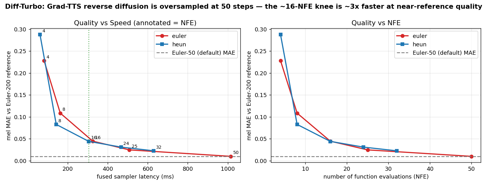

# Fast Indic TTS — Diff-Turbo + Indic-Prosody

Two systems covering the Text-to-Speech stack end to end: an LLM **linguistic
front-end** (text normalization and grapheme-to-phoneme for code-mixed
Hindi/English) and a GPU **acoustic back-end** (faster Grad-TTS diffusion
inference via a higher-order solver and fused Triton kernels).

All numbers below were measured on an NVIDIA A100-SXM4-80GB (PyTorch 2.8 /
CUDA 12.8, Triton 3.4) and are reproducible from the scripts in this repo.

**Live demo (chains both halves):** https://huggingface.co/spaces/AK04-IXR/fast-indic-tts
— type code-mixed text, see the normalized form and phonemes, and synthesize
audio with a selectable diffusion-step count. (Free CPU Space, so a run takes a
little while.)

| Component | What it does | Result |
|---|---|---|
| [`indic_prosody_frontend`](indic_prosody_frontend) | Sarvam-1 LoRA for TN + G2P | TN word-error **20.9% → 7.96%** vs a competitive rule engine |
| [`diff_turbo_backend`](diff_turbo_backend) | Triton kernels + fast ODE sampler | **3.3× faster Grad-TTS synthesis** at near-reference quality |

---

## Indic-Prosody — LLM front-end

Rule-based text normalization is brittle on real code-mixed input. This
component fine-tunes [`sarvamai/sarvam-1`](https://huggingface.co/sarvamai/sarvam-1)
(2B) for normalization and chains a grapheme-to-phoneme stage, producing a
phoneme string ready for an acoustic model.

### Approach
1. **Naive rules** (`indic-numtowords`) score 43.6% WER on a 40-sentence
   hand-labeled code-mixed test set — they drop acronyms and read identifiers as
   magnitudes (`PNR-8392 → आठ हज़ार…`).
2. **A competitive rule engine** (regex for times/currency/percent/ordinals plus
   an English number speller) reaches 20.9% WER, but still cannot handle acronym
   phonetics, digit-by-digit identifiers, code-mix locale, or context.
3. **Base-model prompting is insufficient.** `sarvam-1` is a base (non-instruct)
   model; 12-shot in-context learning scores 49.9% WER — worse than the rules.
4. **LoRA fine-tuning** on a synthetic, correct-by-construction corpus reaches
   **7.96% WER / 62.5% exact-match**, a 62% relative WER reduction over the rule
   engine (0.94% of parameters trained, 96 MB adapter).

### Text-normalization results (held-out 40-sentence set, `run_tn_eval.py`)

| System | WER ↓ | CER ↓ | Exact-Match ↑ |
|---|---|---|---|
| naive rules (`indic-numtowords`) | 43.56% | 43.70% | 0.0% |
| competitive rules | 20.89% | 17.46% | 27.5% |
| Sarvam-1 base (12-shot ICL) | 49.94% | 35.36% | 5.0% |
| **Sarvam-1 LoRA** | **7.96%** | **6.37%** | **62.5%** |

Per category, the fine-tuned model brings the rule engine's weakest buckets to
0% WER: `otp+id` 57.9→0, `phone` 57.1→0, `flight-code` 45.5→0, `year` 50→0,
`id+time` 25→0, `devanagari-mix` 87.5→0.

The first adapter (14.9% WER) failed on Devanagari script, slash dates, and
comma-grouped lakh numbers — phenomena missing from the synthetic data. Adding
those templates and retraining took it to 7.96%; the 40 test sentences were held
out throughout.

### Grapheme-to-phoneme and the full pipeline
A second LoRA distills `espeak-ng` into the same base model (text → IPA),
reproducing the reference with 0.00% PER / 100% exact phoneme match on a held-out
split (`g2p.py --eval`). The two stages compose into a single front-end:

```
RAW : Mera flight ticket PNR-8392 hai, aur departure 4:30 PM ko hai.
NORM: Mera flight ticket pee-en-aar eight three nine two hai, aur departure four thirty pee-em ko hai.   [TN LoRA]
IPA : miəɹə flaɪt tɪkɪt piːɛnɑːɹ eɪt θɹiː naɪn tuː haɪ ...                                                 [G2P LoRA]
```

### Files
- `data/testset.json` — 40 hand-labeled code-mixed sentences (evaluation set).
- `baseline_rules.py` — naive and competitive rule baselines.
- `make_tn_data.py` — synthetic TN corpus generator.
- `train_lora.py` — LoRA fine-tuning (shared by TN and G2P).
- `llm_normalizer.py` — Sarvam-1 inference (few-shot base and LoRA modes).
- `make_g2p_data.py`, `g2p.py` — G2P distillation, PER evaluation, pipeline.
- `metrics.py`, `run_tn_eval.py` — WER/CER/exact-match and per-category harness.

---

## Diff-Turbo — Triton back-end

Grad-TTS generates a mel-spectrogram by running a U-Net once per reverse-diffusion
step (50 by default). This component reduces synthesis latency and verifies that
the output audio is unchanged.

### Faster sampling (`fast_sampler.py`)
Profiling (below) shows synthesis cost is dominated by the number of function
evaluations (NFE), so the effective lever is fewer steps. Implementing a
2nd-order Heun solver for the probability-flow ODE and sweeping NFE — scoring
mel-spectrogram MAE against a 200-step reference — gives:

| Sampler | NFE | mel MAE ↓ | latency | speedup vs Euler-50 |
|---|---|---|---|---|
| Euler (default) | 50 | 0.0101 | 1015 ms | 1.0× |
| Euler | 25 | 0.0249 | 508 ms | 2.0× |
| **Heun** | **16** | **0.0442** | **305 ms** | **3.33×** |
| Euler | 16 | 0.0447 | 325 ms | 3.12× |
| Heun | 8 | 0.083 | 143 ms | 7.3× |

The default 50 steps is oversampled: ~16 NFE retains near-reference quality at
**3.3× lower latency**, and 8 NFE gives ~7× for a modest quality drop. The Heun
solver is roughly on par with Euler per NFE here (the ODE is mild), edging it at
the knee; the dominant gain comes from reducing NFE.



### Fused Triton kernels
Within each evaluation, the bandwidth-bound element-wise ops are fused so they
make one HBM round-trip instead of several:

```
Mish(x) = x*tanh(softplus(x))                  # 3 eager kernels -> 1 fused kernel
xt = (xt - 0.5*(mu-xt-score)*noise_t*h)*mask   # ~6 eager kernels -> 1 fused kernel
```

`fused_mish` and `fused_sde_step` (`triton_fused_sde.py`) are bit-accurate
against eager PyTorch (matching to ~1e-6, fp32 round-off) and run **1.79× faster
with 33% less VRAM** on the isolated element-wise workload (`Mish(a+b)+c`,
shape 16×80×1024). `BLOCK_SIZE=1024` is chosen for coalesced, warp-aligned access.

### Integration and audio parity (`gradtts_triton.py`)
The kernels and fused reverse loop are patched into pretrained Grad-TTS
(LJSpeech) with the HiFi-GAN vocoder. Fused vs eager mel-spectrograms match
(`allclose(1e-3)=True`, max-abs 2.3e-3, MAE 9.7e-5), so the output audio is
unchanged (`audio_out/eager.wav`, `audio_out/fused.wav`).

### Why kernel fusion alone is not enough (`profile_gradtts.py`)
| Bucket | % of CUDA time |
|---|---|
| attention / einsum / matmul | 69.2% |
| Conv2d | 9.2% |
| Mish (element-wise) | 6.3% |
| GroupNorm | 6.1% |
| add/sub (element-wise) | 2.7% |
| **element-wise total (fused)** | **9.2%** |

Element-wise ops are only 9.2% of runtime, so fusing them yields ~0% end-to-end
on their own — but that cost recurs every step, and reducing the number of steps
scales down the dominant 69% attention cost as well. That is what the fast
sampler exploits.

### Files
- `fast_sampler.py` — Heun solver and NFE sweep; `plot_fast_sampler.py` →
  `fast_sampler_curve.png`.
- `triton_fused_sde.py` — fused kernels (`fused_mish`, `fused_sde_step`,
  `fused_add_mish`, residual-block variants) with an eager fallback.
- `verify_kernel.py` — `torch.allclose` correctness checks.
- `benchmark.py` — kernel and block latency / VRAM.
- `gradtts_triton.py` — Grad-TTS integration, parity, audio, benchmark.
- `profile_gradtts.py` — op-breakdown profile of the reverse loop.
- `torch_profiler_script.py` — eager residual-block profile.

---

## Pretrained adapters (Hugging Face)
The LoRA adapters are hosted on the Hub and gitignored here to keep the repo
light. Load them on top of `sarvamai/sarvam-1`:
- TN: [`AK04-IXR/sarvam1-hinglish-tn-lora`](https://huggingface.co/AK04-IXR/sarvam1-hinglish-tn-lora)
- G2P: [`AK04-IXR/sarvam1-hinglish-g2p-lora`](https://huggingface.co/AK04-IXR/sarvam1-hinglish-g2p-lora)

```python
from peft import PeftModel
from transformers import AutoModelForCausalLM
m = AutoModelForCausalLM.from_pretrained("sarvamai/sarvam-1")
m = PeftModel.from_pretrained(m, "AK04-IXR/sarvam1-hinglish-tn-lora")
```

## Reproduce

```bash
pip install -r requirements.txt        # plus peft, phonemizer; espeak-ng via apt
# Front-end (GPU recommended for the LLM):
python indic_prosody_frontend/make_tn_data.py --n 8000
python indic_prosody_frontend/train_lora.py --data data/train.jsonl --out sarvam_tn_lora
python indic_prosody_frontend/run_tn_eval.py --base-llm --adapter sarvam_tn_lora
python indic_prosody_frontend/g2p.py --eval --pipeline
# Back-end (CUDA + Triton):
python diff_turbo_backend/verify_kernel.py
python diff_turbo_backend/benchmark.py
python diff_turbo_backend/gradtts_triton.py --gradtts <path-to-Grad-TTS>
python diff_turbo_backend/profile_gradtts.py --gradtts <path-to-Grad-TTS>
python diff_turbo_backend/fast_sampler.py  --gradtts <path-to-Grad-TTS>
python diff_turbo_backend/plot_fast_sampler.py
```

The back-end scripts expect a local checkout of
[Grad-TTS](https://github.com/huawei-noah/Speech-Backbones/tree/main/Grad-TTS)
with the LJSpeech and HiFi-GAN checkpoints in `Grad-TTS/checkpts/`.

## Notes and limitations
- The TN test set is 40 sentences; the per-category breakdown and held-out
  protocol matter as much as the aggregate. Training data is synthetic, so the
  model follows the corpus's normalization conventions — a human-labeled set is
  the natural next step.
- The G2P stage is distilled from `espeak-ng`, so it matches that reference
  rather than surpassing it; the contribution is a single model covering both TN
  and G2P. Code-switched phonemization (per-span language identification) is left
  for future work, and Devanagari-carrier lines are excluded from the G2P split.
- The 3.3× speedup comes from NFE reduction; the fused kernels are correct and
  1.79× on their own slice but ~0% end-to-end in isolation, since element-wise
  ops are 9% of runtime. Quality is measured by mel-MAE against a 200-step
  reference; a perceptual listening test would be the next validation step.

## Acknowledgements
[Grad-TTS](https://github.com/huawei-noah/Speech-Backbones/tree/main/Grad-TTS)
(Huawei Noah's Ark Lab), [HiFi-GAN](https://github.com/jik876/hifi-gan),
[`sarvamai/sarvam-1`](https://huggingface.co/sarvamai/sarvam-1), and
[espeak-ng](https://github.com/espeak-ng/espeak-ng). MIT licensed; see `LICENSE`.
